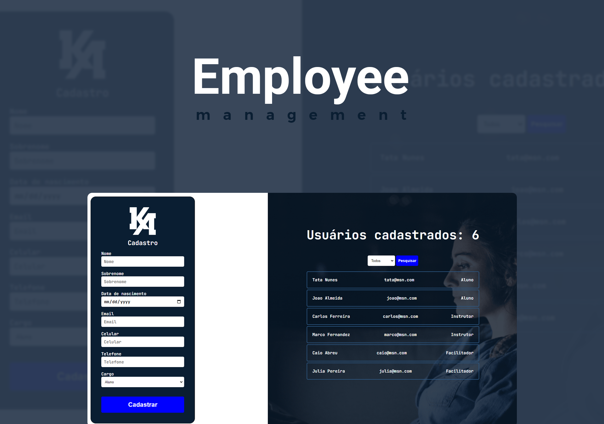

<h1 align="center">
  
</h1>
 

  <a href="#-projeto">Projeto</a>&nbsp;&nbsp;&nbsp;|&nbsp;&nbsp;&nbsp;
  <a href="#-tecnologias">Tecnologias</a>&nbsp;&nbsp;&nbsp;|&nbsp;&nbsp;&nbsp;
  <a href="#-features">Features</a>&nbsp;&nbsp;&nbsp;|&nbsp;&nbsp;&nbsp;
  <a href="#-layout">Layout</a>&nbsp;&nbsp;&nbsp;|&nbsp;&nbsp;&nbsp;
  <a href="#-executando-o-projeto">Executando o projeto</a>&nbsp;&nbsp;&nbsp;|&nbsp;&nbsp;&nbsp;
  <a href="#memo-licença">Licença</a>

 

  
  
  
  

  <a href="https://employee-management-neon.vercel.app/">Clique aqui</a> para acessar a versão web

## ✨ Projeto

Neste app você consegue efetuar o cadastro de funcionários e ao lado acompanhar a listagem e quantidade dos mesmos, além de ter a opção de filtro por cargo. Este é um projeto simples para que eu pudesse treinar a captação de dados via formulários, filtros, modal, POO e DOM. 

## 🚀 Tecnologias

Esse projeto foi desenvolvido com as seguintes tecnologias:

<table border="0">
 <tr>
<td> HTML</td>
<td> CSS</td>
<td> JavaScript</td>
<td> DOM</td>
<td> POO</td>
 </tr>
</table>

## 🌟 Features

-   [ ] Formulário para cadastro de funcionários.
-   [ ] Listagem dos funcionários em tela.
-   [ ] Quantidade de usuários cadastrados.
-   [ ] Filtro de pesquisa de funcionários por cargo.

## 🎨 Layout

Este projeto não foi desenvolvido a partir de um figma.

## 👨🏻‍💻 Executando o projeto

Para executar este projeto em seu computador, abra o mesmo no VSCode e utilize a extensão **Live Server**.

## :memo: Licença

Esse projeto está sob a licença MIT. Veja o arquivo [LICENSE](./LICENSE.md) para mais detalhes.

---
